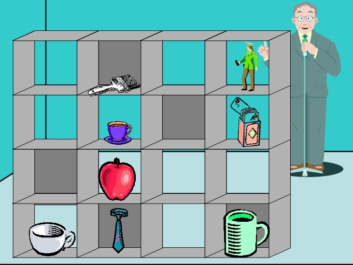
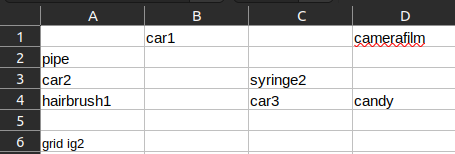

# psychopy-directortask

Psychopy implementation of Director Task, as described by Dumontheil et al. (2010). Besides the simple position, the mouse dragging and measurements have been implemented. Check the `issues` to see what can be improved.

Material needed to make it work:

- experiment.xlsx: an excel file, containing in each sheet the distribution of pictures in the set. To be put in `materials/` folder.
- images and sounds: to be put under `materials/imgs` folder. They can be based on the distribution as mentioned at [IDCNLab](https://sites.google.com/site/idcnlab/director-task?pli=1) work. As you can see below, there might be different versions of an object (for example `car1`), and they are stored as described (e.g. `materials/imgs/car1.png`). Check `utils.py` for understanding more.

### Installation

This installs the code in a protected environment.
It assumes you have installed python in your computer.  
If not go to [python-downloads](https://www.python.org/downloads/) and dowload it from there.  
Then you run this in your command line.

`sh installer.sh`

### Running

This will initialize the data and extract the steps 1-by-1.  
`sh runner.sh`

### Info

- Psychopy code can be found @ `directortask.py`
- Logic can be found @ `utils.py`

## References

1. Dumontheil, I., Apperly, I.A. and Blakemore, S.-J. (2010), Online usage of theory of mind continues to develop in late adolescence. Developmental Science, 13: 331-338. https://doi.org/10.1111/j.1467-7687.2009.00888.x
